# TicketCine — Secciones complementarias del informe

> Continúan la numeración del informe "Sistema de venta de ticket para películas en un cine" (secciones 1 a 9). Las imágenes están en `docs/img/`.

## 10. Landing page (HTML/CSS)

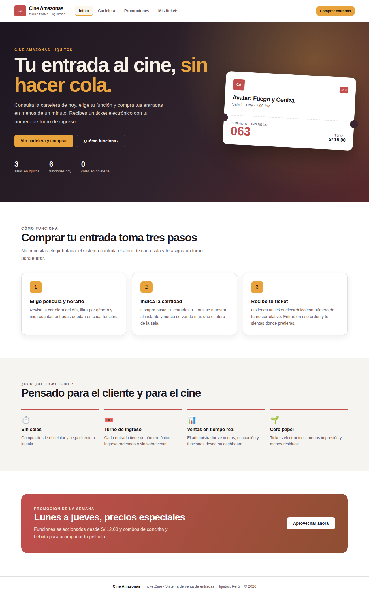

*Figura 1. Landing page de TicketCine construida solo con HTML5 y CSS3 (archivo `mvp/index.html`).*

La landing page es la puerta de entrada pública de TicketCine. Está escrita únicamente con HTML semántico (`header`, `nav`, `main`, `section`, `article`, `footer`) y una hoja de estilos propia (`mvp/css/estilos.css`) que reutiliza la paleta de la aplicación Spring/JSP (blanco, ámbar `#e8a33d` y rojo terciopelo `#c24e4e`). No usa JavaScript ni frameworks.

**Secciones de la landing**

| Sección | Contenido | Propósito |
| --- | --- | --- |
| Encabezado | Logo CA, menú (Inicio, Cartelera, Promociones, Mis tickets) y botón "Comprar entradas" | Navegación constante y acceso directo a la compra |
| Hero | Titular "Tu entrada al cine, sin hacer cola", ejemplo de ticket con turno y cifras (3 salas, 6 funciones, 0 colas) | Comunicar la propuesta de valor en segundos |
| Cómo funciona | Tres pasos: elegir función, indicar cantidad, recibir ticket | Explicar el proceso de compra por aforo y turno |
| ¿Por qué TicketCine? | Sin colas, turno de ingreso, ventas en tiempo real, cero papel | Resumir los beneficios para cliente y administración |
| Promoción | Promoción de lunes a jueves | Atraer público (relacionado con OBJ 4) |
| Pie | Datos del cine | Identidad y cierre |

**Utilidad**

- **Para el cliente:** entiende en un vistazo qué ofrece el sistema y llega a la cartelera con un solo clic, lo que apoya el OBJ 1 (reducir colas) y el OBJ 4 (mejor experiencia).
- **Para Cine Amazonas:** es el canal de difusión de la cartelera, estrenos y promociones, y refuerza la marca en un formato que se ve bien en celular (diseño adaptable con *media queries* y CSS Grid/Flexbox).
- **Para el proyecto:** valida con usuarios el mensaje y el flujo antes de invertir en desarrollo de backend, y sirve como plantilla visual para las vistas JSP.

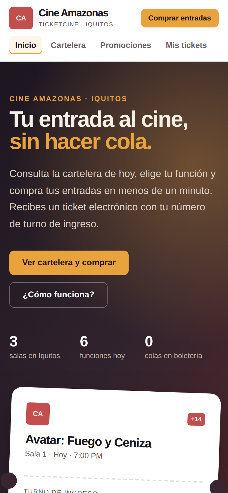

*Figura 2. La misma landing en un celular (390 px de ancho).*

## 11. Storyboard

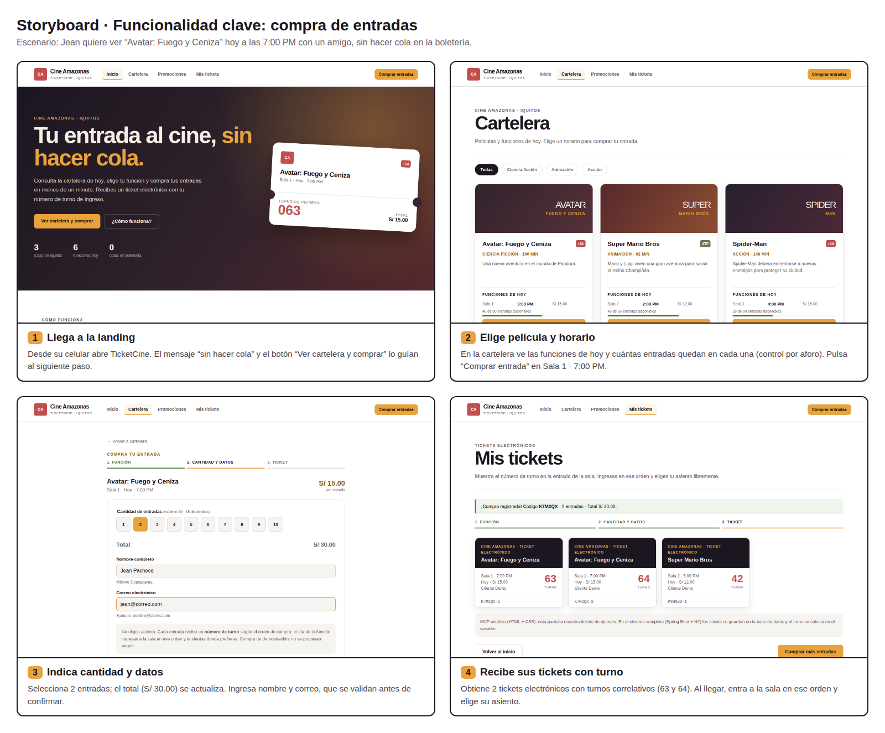

*Figura 3. Storyboard de la funcionalidad clave: compra de entradas.*

**Escenario.** Jean quiere ver "Avatar: Fuego y Ceniza" hoy a las 7:00 PM con un amigo, sin hacer cola en la boletería.

| Viñeta | Pantalla | Acción del usuario | Respuesta del sistema |
| --- | --- | --- | --- |
| 1 | Landing | Abre TicketCine y pulsa "Ver cartelera y comprar" | Muestra la cartelera del día |
| 2 | Cartelera | Revisa funciones y cupos; elige Sala 1, 7:00 PM | Indica las entradas disponibles según el aforo |
| 3 | Compra | Selecciona 2 entradas, escribe nombre y correo | Muestra el total (S/ 30.00) y valida los datos |
| 4 | Mis tickets | Confirma la compra | Emite 2 tickets electrónicos con turnos 63 y 64 |

**Utilidad del storyboard.** Permitió acordar en equipo el recorrido completo del usuario antes de programar, detectar qué datos necesita cada pantalla (función, aforo, precio, turno) y descartar la selección de butacas para simplificar la compra. También sirvió para definir los casos de prueba del flujo.

**Funcionalidad clave.** La compra de entradas (funcionalidades 20, 21, 23 y 25): validar el aforo disponible, calcular el importe (precio × cantidad), registrar la venta en una sola transacción y generar tickets con turno correlativo único por función (RN-08 a RN-11).

**Aprendizajes**

1. Pensar desde el usuario reduce pasos: eliminar el mapa de asientos y usar turnos de ingreso acortó la compra a 3 pantallas.
2. Mostrar los cupos restantes en la cartelera evita frustraciones y anticipa la regla de aforo.
3. El total debe verse antes de confirmar; la confirmación es un paso separado para evitar compras accidentales.
4. Hay que contemplar al cliente sin cuenta: por eso el sistema completo permite "Seguir como invitado".
5. El storyboard es una herramienta barata para validar ideas con el docente y los compañeros antes de escribir código.

## 12. MVP (HTML + CSS) y despliegue en la nube

El MVP (Producto Mínimo Viable) es un prototipo navegable de la parte pública de TicketCine, hecho **solo con HTML5 y CSS3**, sin JavaScript. Se ubica en la carpeta `mvp/` del repositorio y se publica como sitio estático en **Vercel**.

| Pantalla | Archivo | Qué demuestra |
| --- | --- | --- |
| Landing | `index.html` | Propuesta de valor y acceso a la compra |
| Cartelera | `cartelera.html` | Películas, funciones, precios y cupos por aforo; filtro por género con `:target` |
| Compra | `compra-1.html` … `compra-5.html` | Cantidad de 1 a 10 (nunca más que los cupos), total calculado con CSS (`:has()`), validación de nombre y correo con atributos HTML5 (`required`, `type="email"`, `minlength`) |
| Mis tickets | `mis-tickets.html` | Tickets electrónicos con número de turno |

Una función agotada (Spider-Man, 8:00 PM) no tiene página de compra y su botón aparece deshabilitado, lo que muestra la regla RN-08 en el propio prototipo.

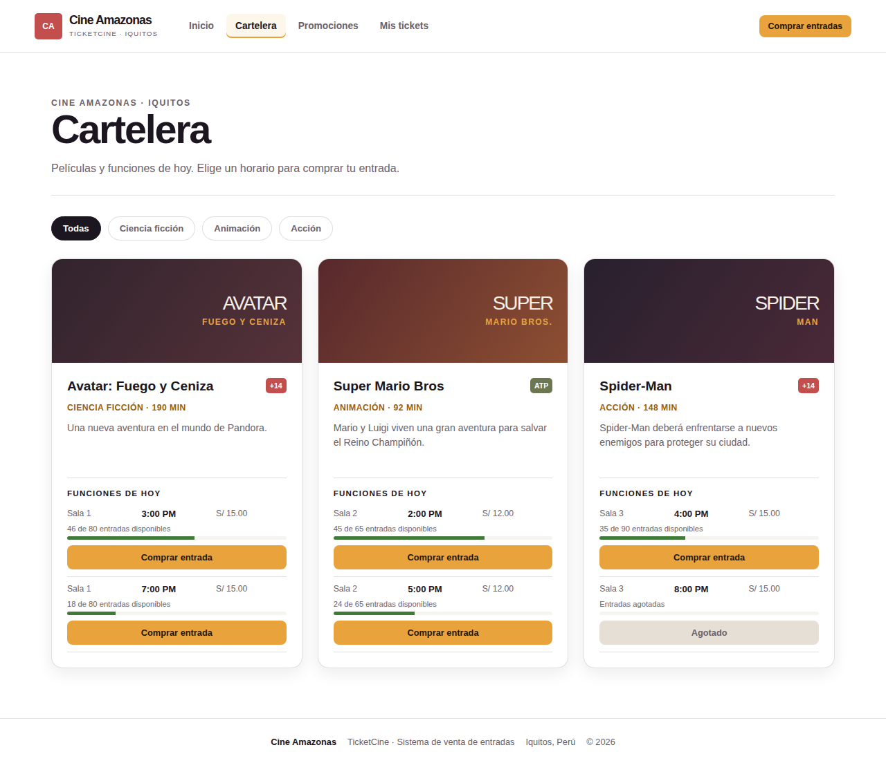

*Figura 4. Cartelera del MVP con cupos disponibles por función.*

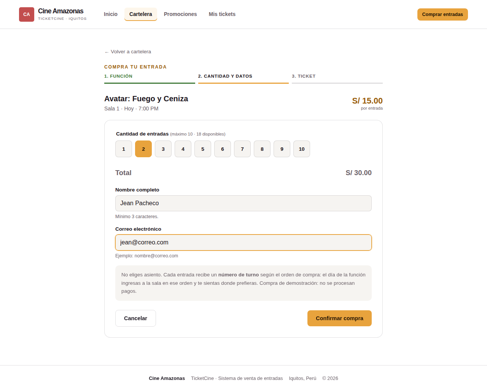

*Figura 5. Pantalla de compra: cantidad, total, datos del cliente.*

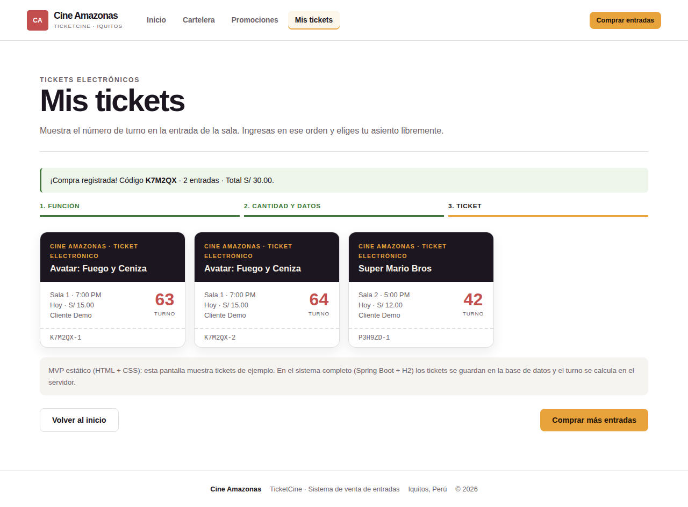

*Figura 6. Tickets electrónicos con turno de ingreso.*

**Alcance.** El MVP valida la interfaz y el flujo; no guarda datos. La lógica real (aforo, transacción, turnos, roles, PBKDF2) vive en la aplicación Spring Boot + H2, que se ejecuta con `java -jar cine-amazonas.war`.

**Despliegue en Vercel**

1. Subir el repositorio a GitHub (incluye `vercel.json`, que publica la carpeta `mvp/` sin compilación).
2. En vercel.com → *Add New… → Project* → importar el repositorio.
3. *Framework Preset:* **Other**. Vercel lee `vercel.json` (`outputDirectory: "mvp"`). Pulsar **Deploy**.
4. Copiar la URL pública (por ejemplo `https://ticketcine.vercel.app`) en el informe.

Enlace del MVP: **https://__________.vercel.app**

**Capturas de la aplicación completa (Spring Boot + JSP + H2)**

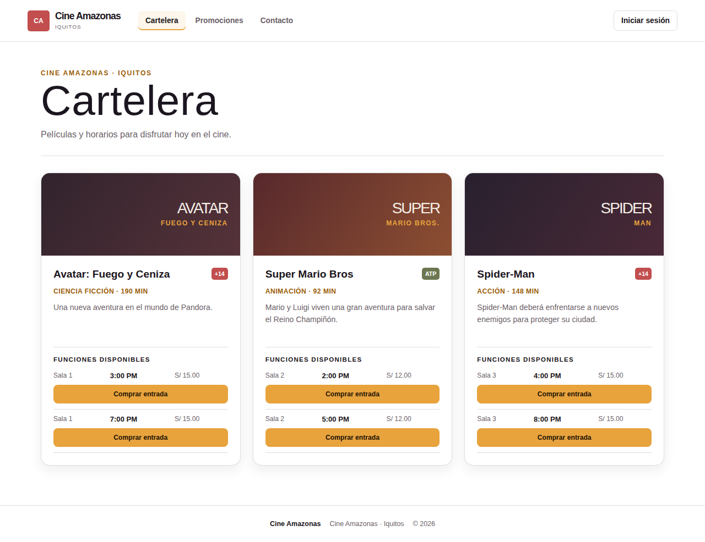

*Figura 7. Cartelera servida por Spring Boot con datos de H2.*

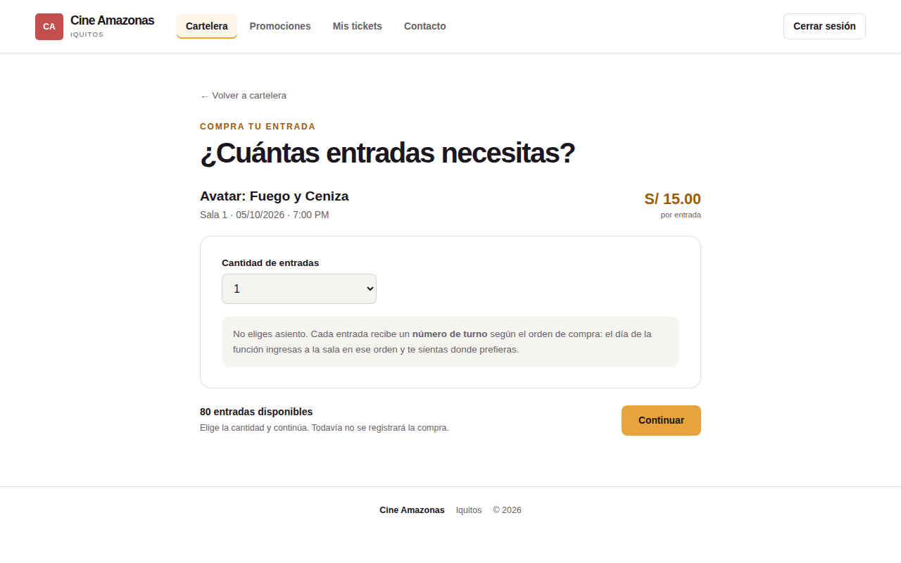

*Figura 8. Selección de cantidad de entradas (validada en el servidor).*

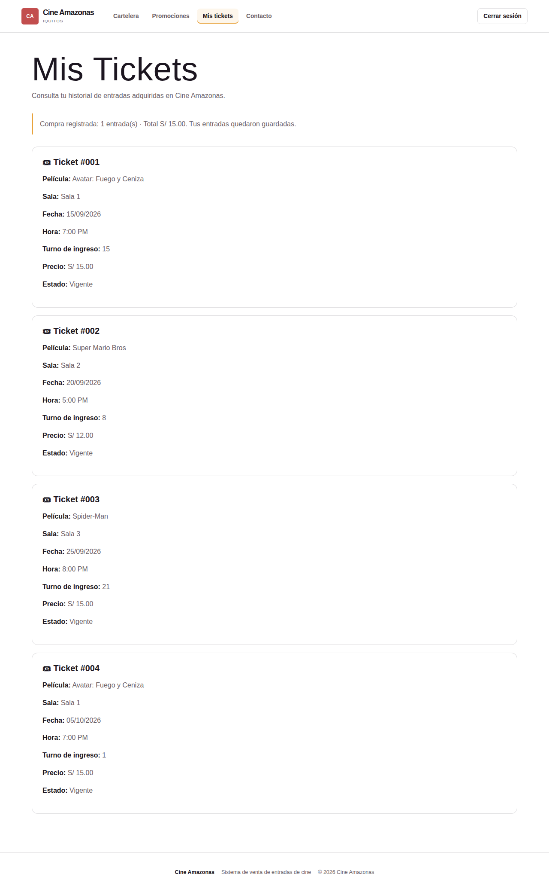

*Figura 9. Historial de tickets del cliente con su turno.*

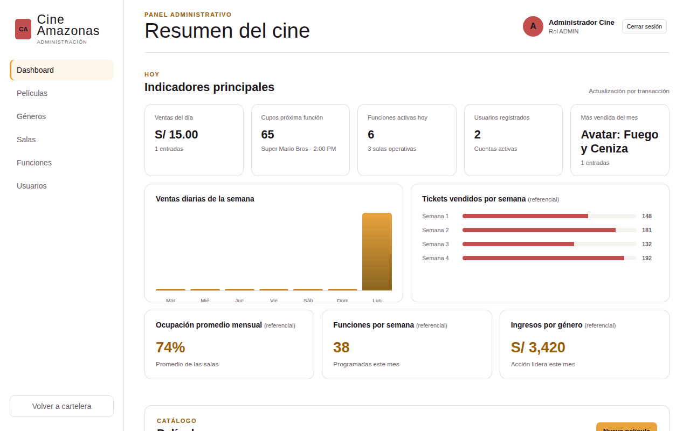

*Figura 10. Dashboard administrativo con métricas reales leídas de H2.*

## 13. Diagrama de arquitectura

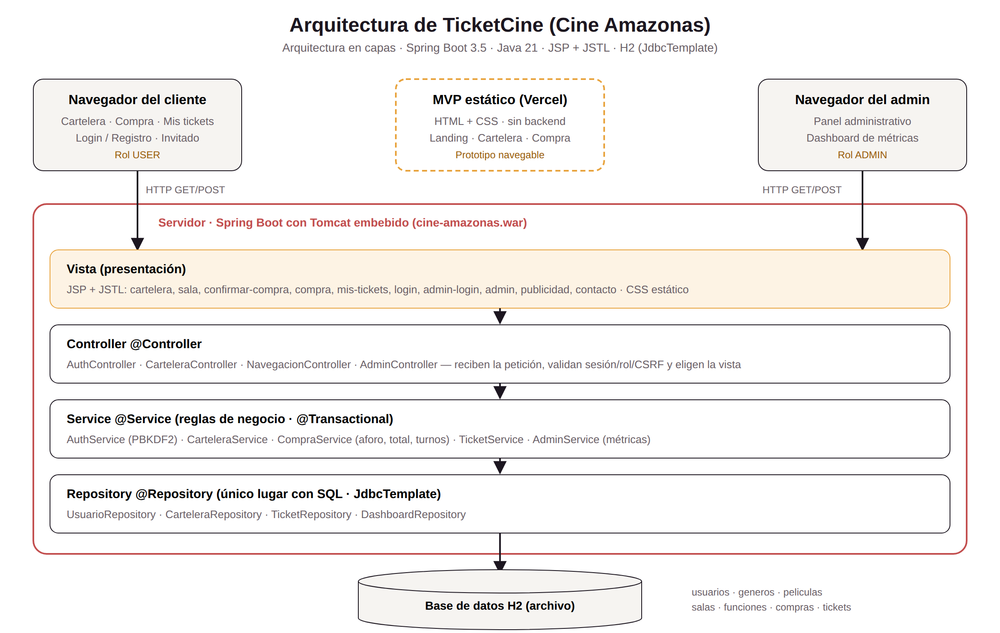

*Figura 11. Arquitectura en capas de TicketCine.*

TicketCine aplica una **arquitectura en capas** sobre el patrón **MVC** de Spring:

| Capa | Componentes | Responsabilidad |
| --- | --- | --- |
| Cliente | Navegador (USER / ADMIN) | Envía peticiones HTTP GET/POST con formularios |
| Vista | JSP + JSTL, CSS | Muestra los datos en el servidor; sin JavaScript |
| Controller | `AuthController`, `CarteleraController`, `NavegacionController`, `AdminController` | Recibe la petición, comprueba sesión, rol y token CSRF, y elige la vista |
| Service | `AuthService`, `CarteleraService`, `CompraService`, `TicketService`, `AdminService` | Reglas de negocio: credenciales PBKDF2, aforo, total, turnos, métricas; `@Transactional` en la compra |
| Repository | `UsuarioRepository`, `CarteleraRepository`, `TicketRepository`, `DashboardRepository` | Único lugar con SQL (`JdbcTemplate`) |
| Datos | H2 en archivo | Tablas usuarios, géneros, películas, salas, funciones, compras y tickets |

**Flujo de una compra:** `POST /comprar` → `CarteleraController` → `CompraService.registrarCompra` (bloquea la función, cuenta entradas, valida aforo, calcula total y asigna turnos) → `TicketRepository` → H2. Cada capa solo se comunica con la siguiente, lo que facilita las pruebas y el mantenimiento.

El MVP estático en Vercel se muestra aparte: es un prototipo de la capa de presentación y no se conecta con el servidor.

## 14. Técnicas de ingeniería web y propuesta metodológica

### 14.1 Técnicas de ingeniería web aplicadas

| Técnica | Cómo se aplicó en TicketCine |
| --- | --- |
| Diagnóstico y requisitos | Análisis social, económico, tecnológico y ecológico; objetivos OBJ 1 a OBJ 4; 25 funcionalidades y 14 reglas de negocio |
| Modelado | Diagrama entidad-relación, diccionario de datos, casos de uso y diagramas de secuencia (compra y gestión de catálogo) |
| Prototipado | Storyboard → landing y MVP en HTML/CSS → vistas JSP |
| Arquitectura en capas / MVC | Controller → Service → Repository con Spring Boot |
| Diseño adaptable (*responsive*) | CSS Grid, Flexbox y *media queries*; probado en escritorio y celular |
| Usabilidad y accesibilidad | HTML semántico, etiquetas `label`, `aria-*`, contraste de colores, mensajes de error claros |
| Seguridad web | Contraseñas PBKDF2 con sal, sesiones con cookie `HttpOnly` y `SameSite`, token CSRF en formularios, separación de roles, consultas parametrizadas contra inyección SQL |
| Integridad de datos | Transacción `@Transactional`, bloqueo `SELECT … FOR UPDATE`, índice único `(función, turno)`, patrón POST-Redirect-GET para no duplicar compras |
| Pruebas automatizadas | 32 pruebas con JUnit y MockMvc (`./mvnw test`): registro, login, roles, aforo, turnos, invitado, reenvíos, métricas |
| Control de versiones y despliegue | Git/GitHub; MVP desplegado en Vercel; aplicación empaquetada como WAR ejecutable |

### 14.2 Propuesta metodológica: Scrum con prototipado incremental

Se propone **Scrum** (marco ágil) combinado con **prototipado evolutivo**, porque el equipo es pequeño, los requisitos se aclaran al ver pantallas y el curso exige entregas parciales.

**Roles**

| Rol | Responsable |
| --- | --- |
| Product Owner | Pacheco Gaspar Jean Brandon (prioriza el Product Backlog con la visión de Cine Amazonas) |
| Scrum Master | Arroyo Tello Geraldo Gerson (facilita las reuniones y elimina impedimentos) |
| Equipo de desarrollo | Quispe Meza Renzo, Zamudio Benito Dayaneira Judith y Pacheco Gaspar Jean Brandon |

**Eventos:** sprints de 2 semanas; *Sprint Planning* al inicio, *Daily* breve (presencial o por WhatsApp), *Sprint Review* con demostración al docente y *Retrospectiva*.

**Artefactos:** Product Backlog (las 25 funcionalidades como historias de usuario), Sprint Backlog en un tablero Kanban (Por hacer / En curso / Hecho) y el incremento funcionando al final de cada sprint.

**Plan de sprints**

| Sprint | Objetivo | Entregable |
| --- | --- | --- |
| 0 | Diagnóstico, objetivos, requisitos y reglas de negocio | Documento inicial, Product Backlog |
| 1 | Prototipado: storyboard, landing y MVP HTML/CSS | Storyboard, MVP en Vercel |
| 2 | Modelo de datos y arquitectura | Diagrama ER, diccionario, diagrama de arquitectura, proyecto Spring Boot base |
| 3 | Autenticación y roles | Login, registro, PBKDF2, acceso admin |
| 4 | Proceso core: compra de entradas | Cartelera, cantidad, confirmación, tickets con turno, invitado |
| 5 | Administración y dashboard | Panel admin, métricas, pruebas y ajustes finales |

**Definición de "Hecho":** la historia funciona en la aplicación, cumple sus reglas de negocio, tiene pruebas que pasan y está subida al repositorio.

## 15. Conclusiones

1. **Diagnóstico → objetivos.** El análisis social, económico, tecnológico y ecológico mostró un público joven y digital, un sector en crecimiento y la necesidad de reducir colas y papel. Esto justificó los objetivos OBJ 1 a OBJ 4 y el desarrollo de TicketCine.
2. **Objetivos → funcionalidades.** Las 25 funcionalidades y 14 reglas de negocio cubren los objetivos: la compra en línea con turno reduce colas (OBJ 1), el panel CRUD ordena la operación (OBJ 2), el dashboard apoya las decisiones del propietario (OBJ 3) y la cartelera, los tickets electrónicos y las promociones mejoran la experiencia (OBJ 4).
3. **Prototipos → producto.** El storyboard y el MVP en HTML/CSS validaron el flujo de compra antes de programar el backend; la decisión de vender por aforo y turno, en lugar de butaca, simplificó el sistema sin perder control de la capacidad.
4. **Arquitectura → calidad.** La arquitectura en capas Controller → Service → Repository separa responsabilidades, permite probar cada parte (32 pruebas automatizadas) y garantiza la integridad de las ventas con transacciones y restricciones en la base de datos.
5. **Metodología → entrega.** Scrum con prototipado incremental permite entregar valor en cada sprint, incorporar la retroalimentación del docente y coordinar al equipo.
6. **Trabajo futuro.** Integrar una pasarela de pago, completar las acciones de crear/editar/desactivar del panel, convertir en reales las métricas de series de tiempo y desplegar la aplicación Spring Boot en un servicio en la nube con una base de datos administrada.
